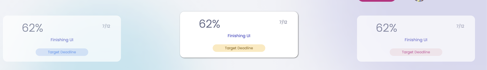
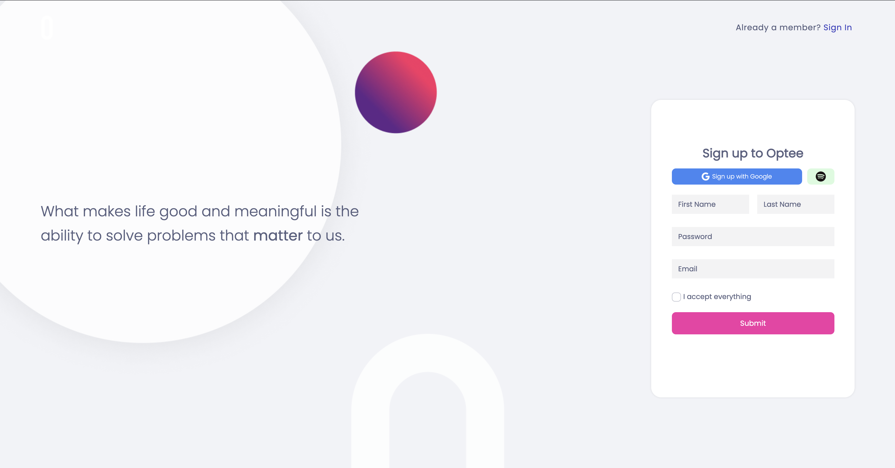
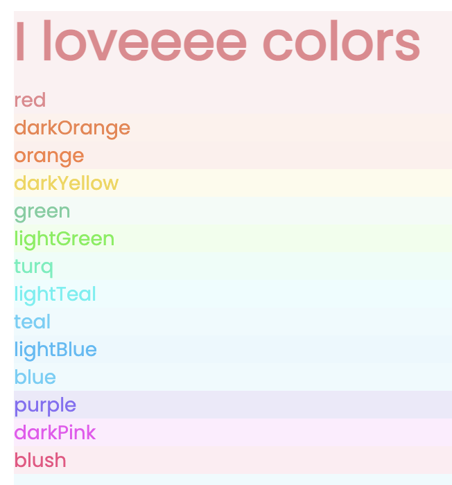
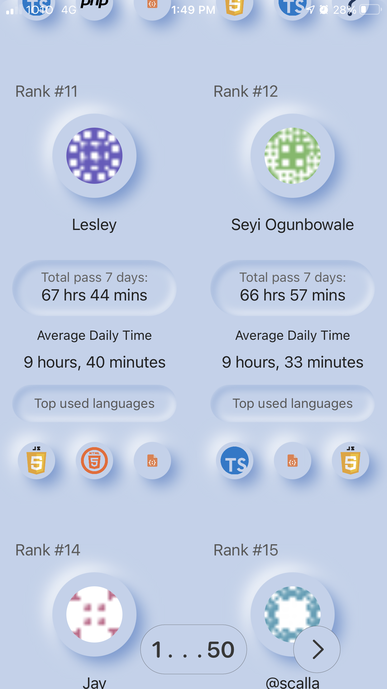

## total code time ✨ 
### hi 👋
 
*stats powered by wakatime*
 

“Homo sum: humani nil a me alienum puto”  
*I am human; I consider nothing human alien to me.* 
～人所具有的，我都具有～ 
*my homeboy, Terence 
Roman Comic Playwright* 
#### What I'm Making 🎁 
- https://www.kellan.page 

- https://www.debugging.tools (in progress :D) 

currently on hold: 
https://hyggechats.club
 
</img>
</img> 

 
a random fact   

<!-- 
#### Names 😄
lesley, lezzles, lelegai  -->
<!-- **lezzles11/lezzles11** is a ✨ _special_ ✨ repository because its `README.md` (this file) appears on your GitHub profile. -->

<!-- - 🌱 I’m currently learning React Native  -->

[What I'm Reading 🌱 ](https://www.goodreads.com/lezzles)
- https://www.goodreads.com/lezzles
<!-- [What I'm Reading 🌱 ](https://www.goodreads.com/user_challenges/27197030) -->
[What I'm Listening To 🤗 ](https://open.spotify.com/user/lezzles11)
<!--  -->

<!-- [What I'm Doing 🎂](https://www.lesleycheung.com) -->
  
  
 
 my proudest moment in 2021 

<!-- [What I'm Accomplishing 🎂 ](https://www.linkedin.com/in/lezzles/) -->

<!--  -->
<!--  -->
<!-- -  
 -->

  
 

<!-- (https://open.spotify.com/user/12168690942) -->

<!-- Here are some ideas to get you started:

- 🔭 What I'm Thinking ...
- 👯 I’m looking to collaborate on ...
- 🤔 I’m looking for help with ...
- 💬 Ask me about ...
- 📫 How to reach me: ...
- 😄 Pronouns: ...
- ⚡ Fun fact: ... -->

